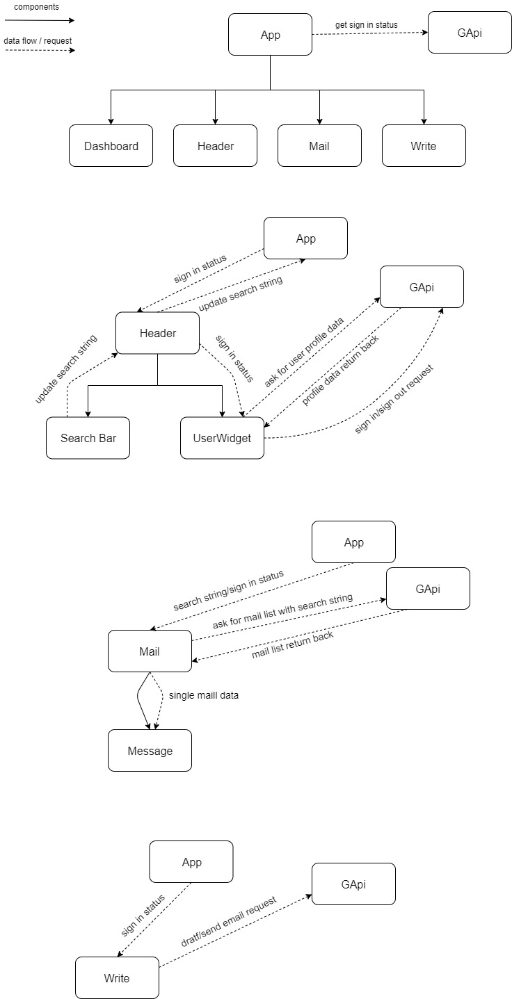

# USyd1933

## Configuration

In order to run the application, you will need to have a valid GMail API key. Currently the project contains a key which is validated for `localhost:8000`, `localhost: 3000` and `travisvalenti.com`. If you'd like to host on a different domain, you will need to have a valid google cloud account, and enable the APIs for Gmail, then copy the API key and client Id to `config.ts`, then rebuild.

Currently the basename setting for the react router is configured to be `.`. If this causes any issues for your use-case, you can change it in the settings too. (A basename of `.` causes all links to be relative, to make it work in on any url, which is ideal for development, but makes some other things not work so well.)

## Build instructions

Building of the application is done with a standard `npm run build`. Prior to this, you will likely need to run `npm install`.

The configuration files can be found in `/config.ts`, which must be modified prior to build, to include the base path of the application (e.g `/Usyd19P33`) and the authorisation tokens / API keys for the Google API.

In order to host the application on a non `localhost:8000` domain, you must configure an API service on google cloud, and use it's details in the config file.

## Tests

Tests for the project are run using `npm test`. We use `jest` and `react-testing-library`/`@testing-library/react` in order to perform the testing. We aim to have each user story tested by completion, but as agile mentality prioritises implementation over testing, we do not have high user story coverage at this time.

## Current state of application

The current state of the application includes most of the utilities used to read emails and a substantial amount of the utilities used to write them.

We also have a timer which will alert the user if they spend too long reading a single email, and have a system which locks the user out if they try and read their emails outside of a specified period (note that this feature is currently disabled during development because it's annoying).

The most notable missing features are:

- Sending emails. This is due to technical difficulties that we are still working to resolve, do to a complex/poorly documented specification.
- Adding attachments to emails. This is a fairly simple addition which will be added after sending emails.
- Options page. Currently we have the architecture to handle this, but no page, as we are still considering different alternatives to storing the data long-term.
- Recommended action prompting. We don't even know where to start with this one.
- Adding emails to a calendar to view later. This is something that we put in as a stretch goal, as requested by Ben Sand

## Diagram

## React

This project was bootstrapped with [Create React App](https://github.com/facebook/create-react-app).

### Available Scripts

In the project directory, you can run:

#### `npm start`

Runs the app in the development mode. 
Open [http://localhost:3000](http://localhost:3000) to view it in the browser.

The page will reload if you make edits. 
You will also see any lint errors in the console.

#### `npm test`

Launches the test runner in the interactive watch mode. 
See the section about [running tests](https://facebook.github.io/create-react-app/docs/running-tests) for more information.

#### `npm run build`

Builds the app for production to the `build` folder. 
It correctly bundles React in production mode and optimizes the build for the best performance.

The build is minified and the filenames include the hashes. 
Your app is ready to be deployed!

See the section about [deployment](https://facebook.github.io/create-react-app/docs/deployment) for more information.

#### `npm run eject`

**Note: this is a one-way operation. Once you `eject`, you can’t go back!**

If you aren’t satisfied with the build tool and configuration choices, you can `eject` at any time. This command will remove the single build dependency from your project.

Instead, it will copy all the configuration files and the transitive dependencies (Webpack, Babel, ESLint, etc) right into your project so you have full control over them. All of the commands except `eject` will still work, but they will point to the copied scripts so you can tweak them. At this point you’re on your own.

You don’t have to ever use `eject`. The curated feature set is suitable for small and middle deployments, and you shouldn’t feel obligated to use this feature. However we understand that this tool wouldn’t be useful if you couldn’t customize it when you are ready for it.

### Learn More

You can learn more in the [Create React App documentation](https://facebook.github.io/create-react-app/docs/getting-started).

To learn React, check out the [React documentation](https://reactjs.org/).
